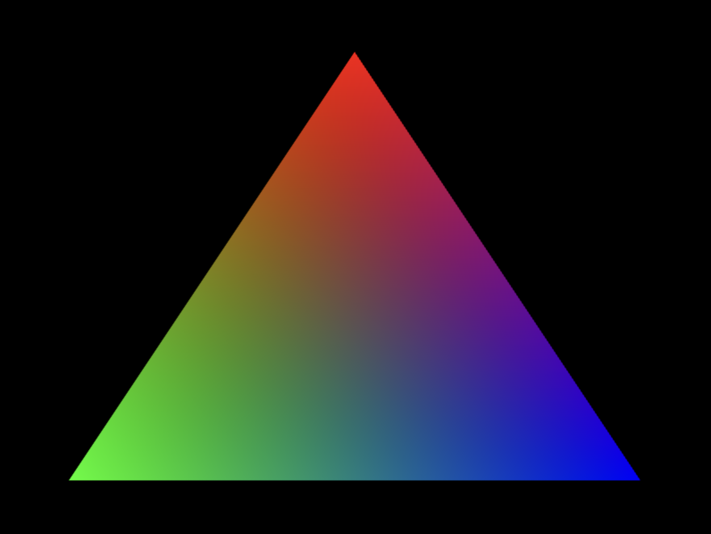

# WebGL Basic 2D Triangle

This project demonstrates how to render a **2D Triangle** using **WebGL** with simple vertex and fragment shaders. The triangle features **color interpolation**, smoothly blending colors between its vertices. Rendered triangle with interpolated colors:

<p align="center">

</p> 
---

## **Overview**
- **Purpose**: To provide a basic example of rendering a triangle in WebGL with vertex and fragment shaders.
- **Key Features**:
  - Uses **vertex attributes** to define position and color per vertex.
  - Implements **fragment color interpolation** for smooth color transitions.
  - Demonstrates basic WebGL buffer setup and rendering pipeline.

---

## **Shaders**
1. **Vertex Shader**:
   - Transforms vertex positions to clip space.
   - Passes vertex color to the fragment shader for interpolation.

2. **Fragment Shader**:
   - Receives interpolated color values for each fragment.
   - Outputs the final pixel color.

---

## **Setup**
1. Clone the repository:
   ```bash
   git clone https://github.com/your-username/webgl-basic-triangle.git
   cd webgl-basic-triangle
   ```
2. Open `index.html` in a browser.
