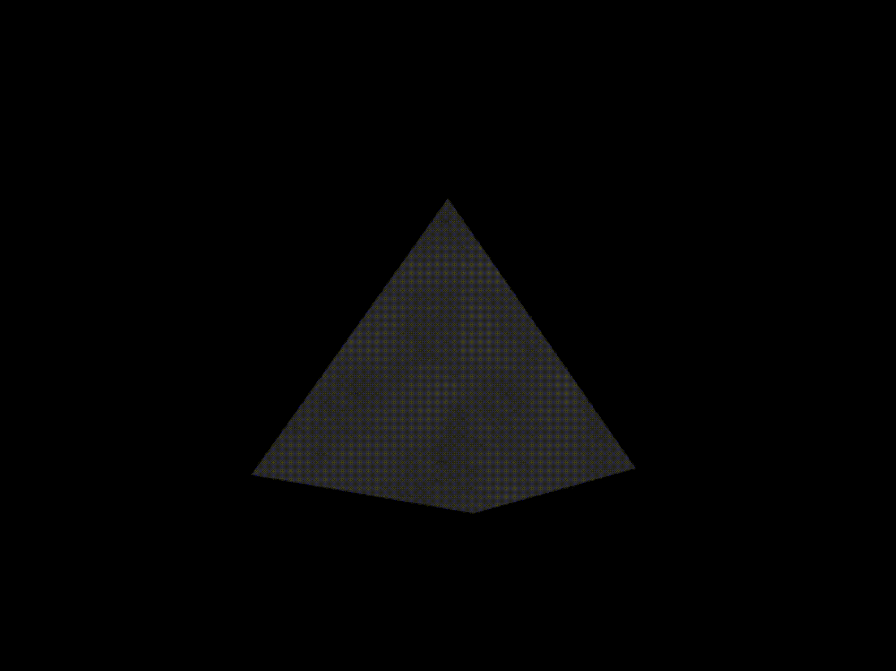

# WebGL Flat-Shaded 3D Pyramid with Directional Light

This project demonstrates how to render a **flat-shaded 3D pyramid** using **WebGL**, where the lighting is calculated using **directional light**. Each face of the pyramid has consistent shading based on its orientation relative to the light source. The pyramid is flat-shaded, with each face shaded based on its alignment with the light direction:

<p align="center">

</p>

---

## **Overview**
- **Purpose**: To showcase flat shading with directional lighting in a 3D WebGL scene.
- **Key Features**:
  - Per-face consistent shading using flat normals.
  - Directional light source with intensity applied uniformly across the scene.
  - Textured surface with light interaction.

---

## **Shading Equation**
### **Diffuse Lighting**
The diffuse lighting is computed using the **dot product** between the **surface normal** and the **light direction**:
```glsl
float diffuse = max(dot(normal, normalize(uLightDirection)), 0.0);
```

1. **`dot(normal, normalize(uLightDirection))`**:
   - Measures how aligned the surface normal is with the light direction.
   - Produces a value between -1 (opposite directions) and 1 (same direction).

2. **`max(..., 0.0)`**:
   - Ensures that negative values are clamped to 0, as negative values indicate the surface is facing away from the light (angle > 90° or π/2 radians).
   - This reflects the fact that light cannot illuminate a surface it cannot "reach" geometrically.

### **Lighting Components**
The final fragment color is calculated as:
```glsl
vec3 finalColor = baseColor.rgb * diffuse * uLightIntensity;
```
- **`baseColor.rgb`**: The sampled texture color.
- **`diffuse`**: The computed diffuse lighting factor.
- **`uLightIntensity`**: The intensity of the directional light.

---

## **Shaders**
### **Vertex Shader**
Transforms vertex positions and passes interpolated normals and texture coordinates to the fragment shader.

### **Fragment Shader**
Calculates the diffuse lighting and applies it to the texture color using the shading equation explained above.
